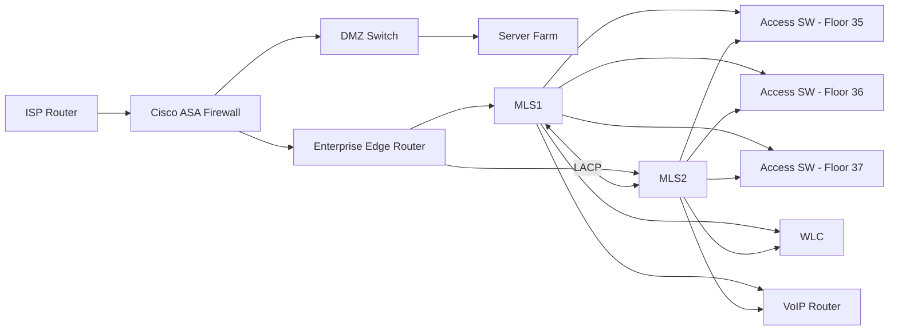

# 02 Network Design

## Design Model

The network uses a hierarchical enterprise model:

- **Edge / Perimeter Layer:** ISP, ASA firewall, enterprise edge router
- **Core / Distribution Layer:** Two multilayer switches providing routing, HSRP, VLAN gateways, and redundant uplinks
- **Access Layer:** Department access switches connecting wired clients, printers, APs, and IP phones
- **Services Layer:** DMZ/server farm for directory, DNS, DHCP, email, file, and healthcare application services
- **Wireless Layer:** WLC with lightweight access points
- **Voice Layer:** VoIP router/CME and IP phones

## Department Layout

| Floor | Departments / Areas |
|---|---|
| 35th Floor | Pharmacy, Medical Labs, Reception, Guest Area |
| 36th Floor | Doctors, Consultancy, Procurement, HR, Finance |
| 37th Floor | Internal Audit, Corporate Functions, IT Teams |

## Logical Segmentation

| Segment | Purpose |
|---|---|
| LAN | Wired employee devices and printers |
| WLAN | Wireless clients and access points |
| Voice | IP phones and voice gateway services |
| DMZ | Servers requiring controlled access |
| Outside | ISP, internet, and cloud simulation |
| Management | Admin access to infrastructure devices |

## Physical / Logical Topology

## Redundancy Design

| Component | Redundancy Method |
|---|---|
| Default gateway | HSRP on multilayer switches |
| Core/distribution interconnect | LACP EtherChannel |
| Access uplinks | Dual uplinks to multilayer switches |
| Server design | Primary/secondary server and storage concept |
| Wireless controller placement | Connected through controller switch/uplink design |
| Routing | OSPF between firewall, edge router, and multilayer switches |

## Design Decisions

### Why VLAN Segmentation?

VLANs reduce broadcast domains and limit lateral movement. LAN, WLAN, and Voice traffic are separated so policy can be applied per user type.

### Why a DMZ?

The DMZ separates server resources from normal client networks. This allows firewall policies to control which internal or external systems can reach sensitive services.

### Why HSRP?

HSRP provides a virtual default gateway. If one multilayer switch fails, clients keep using the same gateway IP and traffic shifts to the standby switch.

### Why EtherChannel?

EtherChannel bundles multiple physical links into one logical link. This increases bandwidth and provides link-level resiliency.

### Why OSPF?

OSPF allows dynamic route advertisement between internal routing devices and the firewall, reducing manual static routing complexity.
